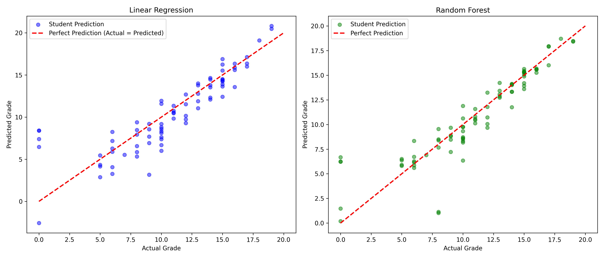

# 🎓 Student Performance Prediction

A Machine Learning project to closely analyze and predict student academic performance using Python and Scikit-Learn.

## 🚀 Overview
This project aims to predict the final grade (**G3**) of students based on various demographic, social, and school-related features. By analyzing factors such as study time, internet access, and past failures, we build a regression pipeline to forecast student success.

**Key Goal:** Accurately predict the score (0-20 scale) using mostly pre-exam data.

## 🛠️ Tech Stack
- **Language**: Python 3.x
- **Data Manipulation**: Pandas, NumPy
- **Visualization**: Matplotlib, Seaborn
- **Machine Learning**: Scikit-Learn (Linear Regression, Random Forest)

## 📂 Project Structure
```text
Student-Performance-ML/
├── data/                   # Dataset (student-mat.csv)
├── models/                 # Serialized trained models (.pkl)
├── results/                # Generated plots and visualization
├── src/                    # Source code modules
│   ├── data_loader.py      # Data ingestion
│   ├── preprocess.py       # One-Hot Encoding & Splitting
│   ├── eda.py              # Exploratory Data Analysis
│   ├── train.py            # Model training logic
│   └── evaluate.py         # Performance metrics
├── main.py                 # End-to-end pipeline execution
└── requirements.txt        # Dependencies
```

## 📊 Workflow

### 1. Exploratory Data Analysis (EDA)
Before modeling, we investigated the dataset to find key correlations:
- **Grade Distribution**: The grades follow a normal distribution roughly, but with a significant number of dropouts (0 grade).
- **Core Correlations**: Past grades (G1, G2) are highly correlated with the final grade.
- **Impact of Failures**: Student with past class failures rarely achieve high final scores.

### 2. Preprocessing
- **Cleaning**: Checked for missing values and handled data types.
- **Encoding**: Converted categorical variables (e.g., `Mjob`, `reason`) into numeric format using **One-Hot Encoding**.
- **Splitting**: Divided data into Training (80%) and Testing (20%) sets to ensure fair evaluation.

### 3. Model Training
We implemented two regression models for comparison:
- **Linear Regression**: A baseline model that assumes linear relationships suitable for interpreting feature impact.
- **Random Forest Regressor**: An ensemble method using 100 decision trees to capture non-linear complex patterns.

### 4. Evaluation
We used **RMSE** (Root Mean Squared Error) and **R² Score** to measure performance.

## 📈 Results & Conclusion

| Model | Strengths | Weaknesses |
| :--- | :--- | :--- |
| **Linear Regression** | Interpretable, fast training. | High error on outliers, underestimates complexity. |
| **Random Forest** | **Lower RMSE**, better generalization. | Black-box nature, computationally heavier. |

**Final Verdict**:
The **Random Forest** model proved to be superior for this dataset. The visualization below demonstrates that while predicting exact grades is difficult due to human behavioral noise, the model successfully captures the general trend of student performance.



## 💻 How to Run
1. **Clone the repository**:
   ```bash
   git clone <your-repo-url>
   ```
2. **Install dependencies**:
   ```bash
   pip install -r requirements.txt
   ```
3. **Run the pipeline**:
   ```bash
   python main.py
   ```